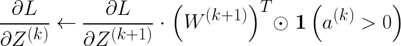
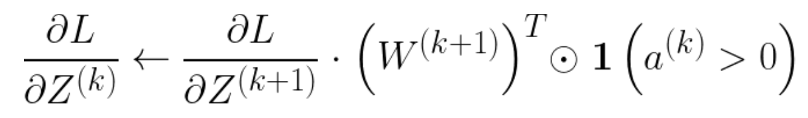
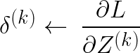
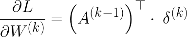
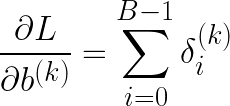
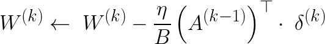
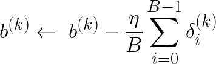
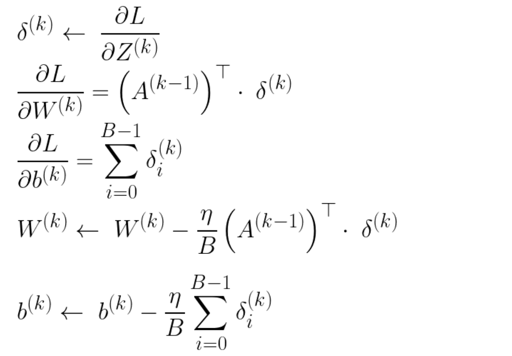

# HPMC: High-Performance MNIST Classification

## Overview

HPMC is a C++/CUDA implementation of an MLP for MNIST classification, achieving up to **8× training speedup** compared to the PyTorch baseline on an RTX 4060 Laptop GPU. The training pipeline was built from scratch without relying on high-level libraries such as `cuBLAS` or `CUTLASS`.
The model is a 2-hidden-layer MLP (784 &rightarrow; 320 &rightarrow; 160 &rightarrow; 10) for MNIST digit classification.
For the performance measurements, the CUDA implementation was executed through Visual Studio Code (see `.vscode` for configuration details), while the PyTorch baseline was run in a Jupyter Notebook environment.

**Note**: For implementation simplicity, the last batch is omitted in both `mnist.cu` and `mnist.ipynb`. 

## Evaluation

### Experiment Settings
- `Epochs = 30`, `batch_size = 64`, `lr = 0.03`
- GPU Metrics: Collected log using `nvidia-smi --query-gpu=memory.used,utilization.gpu --format=csv -l 1 > metric.log`

| Configuration  | Accuracy   | Time per Epoch | GPU Utilization | GPU Memory Usage |
|:--------------:|:----------:|:--------------:|:---------------:|:----------------:|
| `mnist.ipynb`  | 97.78%     | 1798ms         |34%              |145MiB            |
| **`mnist.cu`** | **97.84%** |**218ms**       |**64%**          |**126MiB**        |

For more detailed evaluation results across various `batch_size` options, see [HPMC Evaluation](./eval/EVALUATION.md).

## Configuration Strategy

During kernel grid/block configuration, both compile-time and runtime ceil computations are used selectively for performance and code clarity.

- **Compile-time constants**: a custom `constexpr int _ceil(int a, int b)` is defined to compute `ceil(a / b)` without runtime overhead.
- **Runtime variables**: `std::ceilf()` is used instead of `std::ceil()` to avoid unnecessary float-to-double promotions. Since `std::ceilf()` is optimized for `FP32` arguments, it may result in better performance and type consistency on host code.

But this approach sacrifices flexibility — since `constexpr` requires compile-time constants, dimensions like `layer1_dim` can't be set via CLI.

In this case, using `const int` with `std::ceilf()` instead enables runtime configuration.

## Build & Run

```bash
git clone https://github.com/130bb56/hpmc.git
```
`mnist.cu`
```bash
cd hpmc/data 
chmod +x ./download_mnist_dataset.sh && ./download_mnist_dataset.sh
cd ../cuda && make && ./a
```
or

`mnist.ipynb`
```bash
cd hpmc/torch
jupyter notebook
```

## Compiler Option
```bash
# Architecture-specific build (adjust -arch=sm_xx to your GPU architecture)
nvcc -O3 -NDEBUG -Xptxas=-O3 -arch=sm_89 -maxrregcount=64 -o a mnist.cu
# Optionally add: --use_fast_math
```

## Debugging

HPMC supports both asynchronous and synchronous CUDA error checking for robust debugging during development. Two macros are provided:
```cpp
#define CHECK_ERROR(ans) { cudaAssert((ans), __FILE__, __LINE__); }
#define CHECK_KERNEL_ERROR() { cudaKernelAssert(__FILE__, __LINE__); }
```
These macros use the following error-checking mechanisms:
- **`cudaAssert()`** : Synchronous error checking after host API calls (e.g. `cudaMalloc()`, `cudaMemcpy()`)
- **`cudaKernelAssert()`** : captures asynchronous kernel errors 

To enable full kernel-level sync debugging, launch with `--debug` flag:
```cpp
./a --debug
```
Internally, the debug flag is used to toggle kernel synchronization in `cudaKernelAssert()`:
```cpp
inline void cudaKernelAssert(const char *file, const int line, bool abort = true) {
    if (debug) CHECK_ERROR(cudaDeviceSynchronize());
    cudaError_t err = cudaGetLastError();
    if (err != cudaSuccess) {
        fprintf(stderr, "cudaKernelAssert(): %s\n[%s: %d]\n\n", cudaGetErrorString(err), file, line);
        if (abort) exit(err);
    }
}
```
For more background on proper CUDA error handling, see: 
https://leimao.github.io/blog/Proper-CUDA-Error-Checking/

## Kernel Design and Optimizations

### `forward_relu`
- **Grid**: 2D grid of shape `(ceil(output_dim / block_size), ceil(batch_size / block_size))`
- **Block**: 2D block of shape `(block_size, block_size)`, where `block_size = 16`
- **Optimizations**:
  - Shared memory tiling for `GEMM`(`X @ W + b`)
  - Bank conflict mitigation via padding in `w_tile`
  - Loop unrolling (`#pragma unroll`)
  - ReLU fused directly into the forward kernel

### `forward_softmax`
- **Grid / Block**: Same as `forward_relu`
- **Optimizations**:
  - Shared memory tiling for `GEMM`(`X @ W + b`)
  - Kernel fusion of forward pass and softmax

### `z_grad`
<p>
  <!--  -->
  
</p>

- **Grid / Block**: Same as `forward_relu`
- **Optimizations**:
  - Shared memory tiling for `dz^(k+1) @ (W^(k+1))^T`, where `dz^(k) = ∂L/∂Z^(k)`
  - Loop unrolling (`#pragma unroll`)

### `cross_entropy`
- **Grid**: 1D grid over batch size
- **Block**: 1D block of size `block_size`
- **Optimizations**:
  - Initially used warp-level reduction (`__shfl_down_sync`)
  - The reduction logic itself was correct, but (in my opinion) using 16 threads to reduce only 10 elements introduced minor FP precision errors, which resulted in slightly incorrect loss values
  - For reproducibility consistent with PyTorch, the loss computation was rewritten as a sequential loop unrolled using `#define WIDTH 10`

### `cross_entropy_softmax_grad`
- **Grid**: 1D grid over `ceil(batch_size * output_dim / block_size)`
- **Block**: 1D block of size `block_size`
- **Optimizations**:
  - Eliminate conditional branch `col < height * width`
  - Computes `dz = ∂L/∂Z = y_hat - y` directly to reduce computation overhead

### `update_layer`
<p>
  <!-- 
  <br>
  
  <br>
  
  <br>
  
  <br><br>
   -->
  
</p>

**Note**: For floating-point numerical stability, the `1 / B`​ factor is omitted during gradient computation and applied it only once during the parameter update step.

- **Grid**: 2D grid of shape `(ceil(width / block_size), ceil(height / block_size))`
- **Block**: 2D block of shape `(block_size, block_size)`
- **Optimizations**:
  - Single fused kernel to update both weights and biases with `atomicAdd()`

## Optional Plans

- Eliminate conditional branches (e.g., `if (row < height && col < width)`) to reduce warp divergence, assuming dimension alignment
- Split `forward_softmax` into separate `forward` and `softmax` kernels to eliminate sync overhead
- Replace `.csv` data loading with a binary preprocessed dataset to reduce CPU I/O Bound (~2s)
- Use FP16 TensorCore `wmma::mma_sync`
- Optimize GEMM with memory-coalesced transpose and shared memory alignment (non-TensorCore)
- Use loop-unrolled vectorized memory loads (`reinterpret_cast<float4*>`)
- Support setting `batch_size`, `lr`, and `layer[i].dim` via CLI args to enable experiments with various configs
- Verify that data loading order matches between PyTorch and CUDA by comparing the train/valid arrays

## System Requirements

- CUDA 12.3+