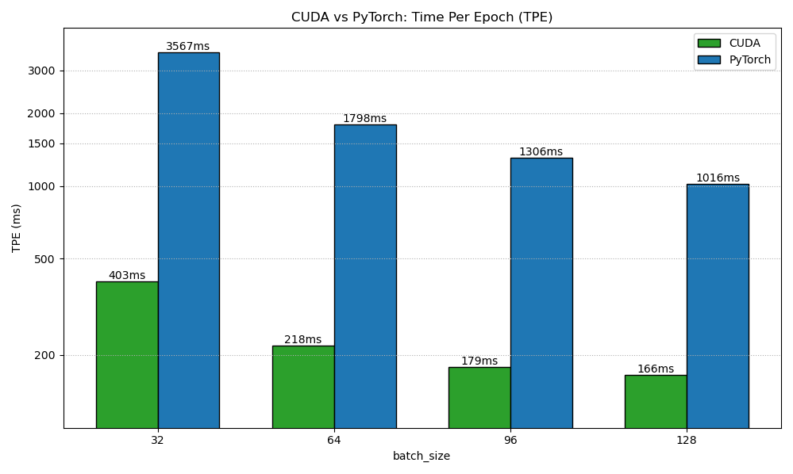
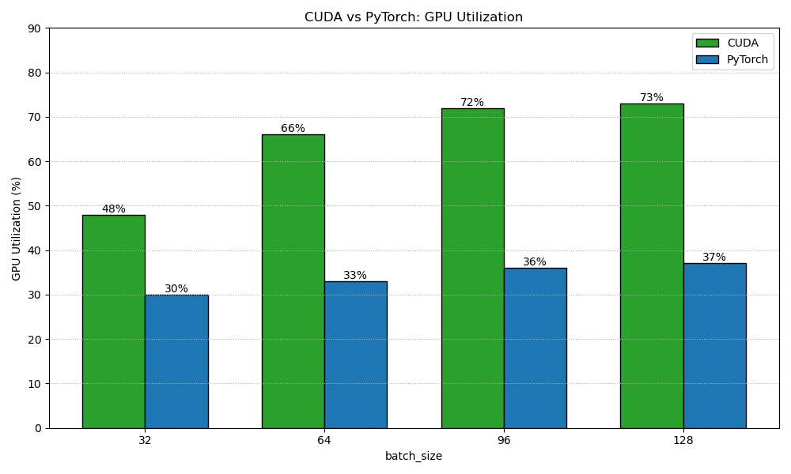
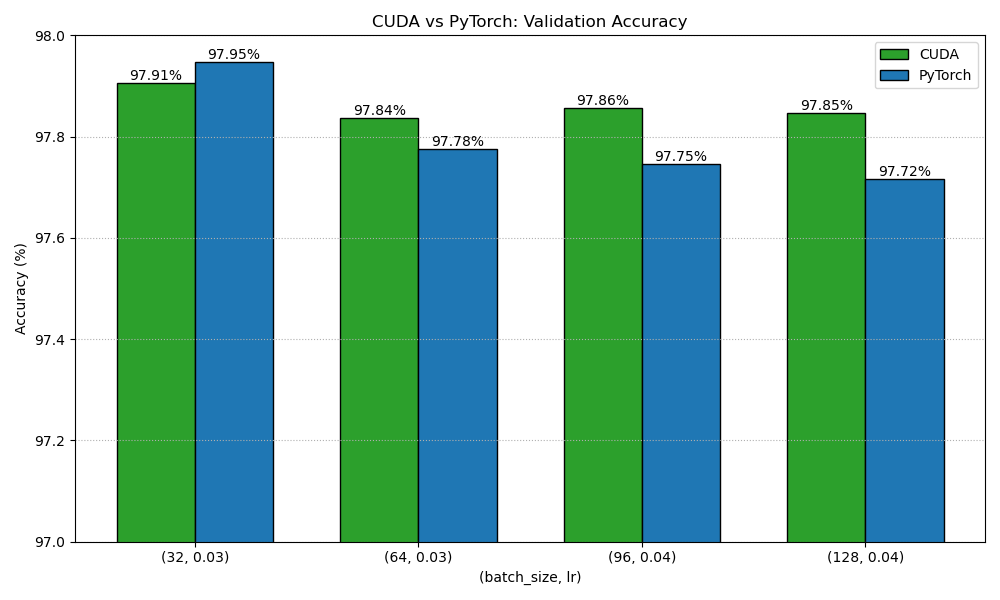

# Evaluation

## Experiment settings
  - `layer1_dim = 320`
  - `layer2_dim = 160`
  - `layer3_dim = 10`
  - `block_size = 16`
  - `TILE_SIZE = 16`
  - `batch_size ∈ {32, 64, 96, 128}`
  - `lr ∈ {0.03, 0.03, 0.04, 0.04}`
---

## Time Per Epoch

## GPU Utilization

## Validation Accuracy

