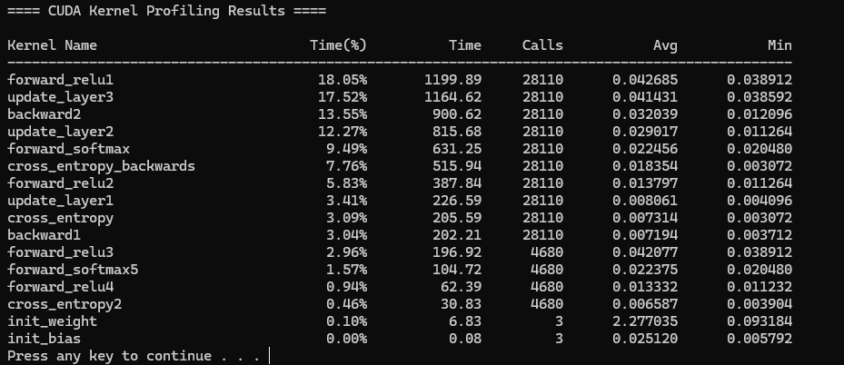

## HPMC: High-Performance MNIST Classification

### 1. 개요
HPMC는 PyTorch 대비 **최대 8배 빠른 학습 속도**를 달성한 C++ CUDA 기반 MLP 구현 프로젝트입니다. `cuBLAS`나 `CUTLASS`와 같은 고수준 라이브러리 없이 End-to-End 학습 파이프라인을 직접 구현하였으며, Kernel Fusion, Shared memory tiling GEMM 등 다양한 CUDA 최적화 전략을 적용하였습니다.
프로젝트의 자세한 사항은 [여기](https://github.com/130bb56/hpmc)에서 확인하실 수 있습니다.

### 2. 문제 정의 및 동기
최근 GPT, LLaMA, Claude 등 LLM이 NLP(Natural Language Processing) 분야에서 혁신적인 성과를 보이고 있습니다. 이러한 모델들은 텍스트 생성, 번역, 요약, 질문 답변 등 다양한 태스크에서 인간에 준하거나 때로는 그를 뛰어넘는 성능을 보여주고 있습니다. 그러나 이러한 뛰어난 성능의 이면에는 모델의 거대한 크기와 복잡성으로 인한 실용적인 문제가 존재합니다. 특히, 실제 서비스에 적용할 때 요구되는 높은 컴퓨팅 자원과 지연 시간(Latency)은 LLM을 산업 현장에서 활용하는 데 Bottleneck이 되고 있습니다. 

마찬가지로, DALL-E와 같은 이미지 생성 모델에서도 inference의 시간이 매우 길어 불편했던 경험이 있으실 것으로 생각됩니다. 이러한 시대적 흐름 속에서, **ML System**에 대한 저수준 최적화의 이해와 적용 능력은 점점 더 중요해지고 있습니다.

본 프로젝트에서는 MLP (Multi-Layer Perceptron)를 CUDA로 밑바닥부터 직접 구현하고 분석함으로써, ML System 최적화에 대한 High-level overview를 얻고자 하였습니다. 특히, 제가 했던 것처럼 약간의 최적화를 통해 PyTorch 대비 정확성을 유지하면서도 월등히 빠른 학습속도를 보인다는 점에서, CUDA를 처음 접하는 학습자에게도 실용적인 학습자료가 될 수 있다고 생각합니다.

### 3. 접근 방식 및 해결 전략

#### 1) 초기
- PyTorch baseline Implementation
- CUDA 포팅: Dataloader 및 `forward`, `relu`, `softmax`, `backward` 등 각각 별도 Kernel 구현하여 End-to-End 학습
- 모델 구조: `784 (Input) → 320 (1st hidden layer) → 160 (2nd hidden layer) → 10 (Class)`
- `batch_size = 64, lr = 0.03, Optimizer = SGD`
- Tensor Shape 및 수식 명시적으로 계산하여 `backward` kernel 디자인

#### 2) 중기
- `forward + relu`, `forward + softmax` 커널 퓨전 적용: 1) 대비 training 4-5x speedup
- Bottleneck을 찾기 위해 Kernel execution latency 정보를 출력하는 Profiling 사용의 필요성을 느낌
    - 기존 `nvprof`는 deprecated, `ncu (Nsight Compute)`는 과다한 GPU metric 제공
    - CUDA Event 기반 Custom Profiler 직접 구현
    
    
    - 원본 코드에 대해 매번 Kernel을 Timer로 Wrap하고, header를 include 후 Global하게 Kernel Timer Instance를 선언해야 하는 문제 발생

      ```cpp
      #include "../profile/profile.cuh"
      ...
      KernelProfiler timer_kernel("kernel_name");
      ...
      timer_kernel.start_timing();
      kernel<<<dimGrid, dimBlock>>>(...);
      CHECK_KERNEL_ERROR();
      kernel.stop_timing();
      ```
      
    - 앞의 과정을 자동화하여 Kernel을 `Regex`로 패턴매칭하여 Kernel 시간 측정 및 출력하는 스크립트 구현

#### 3) 후기
- `forward GEMM`
  - shared memory tiling: Naive `GEMM` 대비 18% latency 단축
  
  - bank conflict 방지를 위한 padding 적용: `PADDING ∈ {1, 2, 4, 8}` 실험 후 `PADDING = 8` 결정
- `cross_entropy`
  - 초기에는 16개의 thread로 warp reduction 수행 → 10개의 class에 대해 FP 오차 발생
  - sequential 방식으로 수정
- `update_layer` 
  - bias 업데이트 과정에서 동일 column에 대해 여러 thread 접근하여 race condition 발생
  - atomicAdd()를 통해 thread-safe하도록 수정
- Compiler directive optimization
  - `nvcc -O3 -NDEBUG -Xptxas=-O3 -arch=sm_89 -maxrregcount=64 -o a mnist.cu`
  - `__restrict__` 활용
  - Loop Unrolling (`#pragma unroll`)

### 4. 벤치마킹 및 실험 결과

#### 1) 실험 설정
- NVIDIA RTX 4060 Laptop GPU
- `batch_size = 64, epoch = 30, block_size = 16, TILE_SIZE = 16`
- GPU Metrics 로그 수집: `nvidia-smi --query-gpu=memory.used,utilization.gpu --format=csv -l 1 > metric.log`

#### 2) 결과

| Configuration | Accuracy | Time per Epoch | GPU Utilization | GPU Memory Usage |
|:-----------------:|:--------:|:--------------:|:-------:|:-------:|
| `mnist.ipynb` | 97.78%     | 1798ms  |33%      |145MiB    |
| **`mnist.cu`**    | **97.84%** |**218ms**|**66%**  |**126MiB**|

여러 구성에 대한 밴치마킹은 [HPMC Evaluation](https://github.com/130bb56/hpmc/blob/main/eval/EVALUATION.md) 참조.

### 5. 한계점 및 향후 계획

본 프로젝트를 통해 시스템 수준에서 ML 성능 병목을 분석하고 최적화하는 전체 과정을 직접 수행함으로써, `PyTorch`의 추상화된 내부를 벗어나 시스템의 내부를 조망하는 경험을 할 수 있었습니다.

그러나 MLP 구조 자체가 현대의 복잡한 ML Workload를 지원하는 대형 모델에 비해 상대적으로 많이 단순하기 때문에, 본 프로젝트의 결과를 일반화하는 데에는 제한이 있습니다. 실제로 `batch_size`가 증가함에 따라 `PyTorch`와 `CUDA`의 속도차이의 gap은 줄어든다는 사실을 [HPMC Evaluation](https://github.com/130bb56/hpmc/blob/main/eval/EVALUATION.md)에서 확인하였습니다.

#### 향후 계획
- CLI 인자를 통한 `batch_size`, `lr`, `layer[i].dim` 설정 지원으로 다양한 구성에서의 실험 가능화
- `forward_softmax`를 별도의 `forward`와 `softmax` Kernel (`Online softmax`)로 분리하여 동기화 오버헤드 제거
- `FP16 TensorCore` `wmma::mma_sync` 활용
- 메모리 코얼레싱된 전치 및 공유 메모리 정렬을 통한 GEMM 최적화 (`FP16 TensorCore`를 사용하지 않을 때)
- loop-unrolled vectorized memory loads (`reinterpret_cast<float4*>`) 사용
- `.csv` 데이터 로딩을 `.bin` 전처리 데이터셋으로 대체하여 CPU I/O 병목 감소(~2초)
- PyTorch와 CUDA 간 Dataloader 순서 일치 여부 검증 (train/valid 배열 비교)

<br>
<br>

---

<br>
<br>

### 6. Appendix

#### 1) 구성 전략 최적화
- 커널 그리드/블록 구성 시, 성능과 코드 명확성을 위해 컴파일 타임과 런타임 올림 계산 선택적 사용
- 컴파일 타임 상수: `constexpr int _ceil(int a, int b)`를 정의하여 런타임 오버헤드 없이 `ceil(a / b)` 계산
- 런타임 변수: 불필요한 float-to-double 변환을 피하기 위해 `std::ceil()` 대신 `std::ceilf()` 사용
- 컴파일러 옵션: `nvcc -O3 -NDEBUG -Xptxas=-O3 -arch=sm_89 -maxrregcount=64`

#### 2) 디버깅 전략
- 두 가지 에러 검사 매크로 제공:
  ```cpp
  #define CHECK_ERROR(ans) { cudaAssert((ans), __FILE__, __LINE__); }
  #define CHECK_KERNEL_ERROR() { cudaKernelAssert(__FILE__, __LINE__); }
  ```
- 동기식(`cudaAssert()`) 및 비동기식(`cudaKernelAssert()`) 오류 검사
- `--debug` 플래그로 전체 커널 수준 동기 디버깅 활성화 가능
  ```cpp
  inline void cudaKernelAssert(const char *file, const int line, bool abort = true) {
      if (debug) CHECK_ERROR(cudaDeviceSynchronize());
      cudaError_t err = cudaGetLastError();
      if (err != cudaSuccess) {
          fprintf(stderr, "cudaKernelAssert(): %s\n[%s: %d]\n\n", cudaGetErrorString(err), file, line);
          if (abort) exit(err);
      }
  }
  ```

#### 3) E2E 수식 및 Tensor Shape

| Layer  | Input Shape | Weight Shape | Output Shape | Activation |
|:------:|:-----------:|:------------:|:------------:|:----------:|
| Layer1 | (64, 784)   | (784, 320)   | (64, 320)    | `ReLU`     |
| Layer2 | (64, 320)   | (320, 160)   | (64, 160)    | `ReLU`     |
| Layer3 | (64, 160)   | (160, 10)    | (64, 10)     | `Softmax`  |

##### MLP forward: $\hat{y} = \text{Softmax}(\text{ReLU}((\text{ReLU}(X W^{(1)} + b^{(1)})) W^{(2)} + b^{(2)}) W^{(3)} + b^{(3)})$
<!-- \[ \hat{y} = \text{softmax}( \text{ReLU}( (\text{ReLU}(X W^{(1)} + b^{(1)})) W^{(2)} + b^{(2)} ) W^{(3)} + b^{(3)} ) \] -->
$Z^{(1)} = X W^{(1)} + b^{(1)}$

$A^{(1)} = \text{ReLU}(Z^{(1)})$

$Z^{(2)} = A^{(1)} W^{(2)} + b^{(2)}$

$A^{(2)} = \text{ReLU}(Z^{(2)})$

$Z^{(3)} = A^{(2)} W^{(3)} + b^{(3)}$

$\hat{y} = \text{Softmax}(Z^{(3)})$

##### Cross Entropy Loss
$L = -\frac{1}{B} \sum_{i=0}^{B-1} y_i^\top \log \hat{y}_i$

##### MLP Backward

`z_grad`: $\frac{\partial L}{\partial Z^{(k)}} = \left( \frac{\partial L}{\partial Z^{(k+1)}} W^{(k+1)\top} \right) \odot \mathbf{1}(A^{(k)} > 0)$

`cross_entropy_softmax_grad` (output layer): $\frac{\partial L}{\partial Z^{(3)}} = \hat{y} - y$

##### Backward 수식 유도

$\frac{\partial L}{\partial W^{(3)}} = \frac{\partial L}{\partial A^{(3)}} \cdot \frac{\partial A^{(3)}}{\partial Z^{(3)}} \cdot \frac{\partial Z^{(3)}}{\partial W^{(3)}}$

$\frac{\partial L}{\partial A^{(3)}} = \frac{\partial}{\partial A^{(3)}}\left(-y^\top \log A^{(3)}\right) = -\frac{y}{A^{(3)}}$

$\frac{\partial A^{(3)}}{\partial Z^{(3)}} = \frac{\partial}{\partial Z^{(3)}} \text{Softmax}(Z^{(3)})$

$\frac{\partial Z^{(3)}}{\partial W^{(3)}} = A^{(2) \top}$

$\log a^{(3)}_k = z_k - \log \left( \sum_j e^{x_j} \right)$ 

$\frac{1}{a^{(3)}_k} \cdot \frac{\partial a^{(3)}_k}{\partial z_k} = \delta_{ik} - a^{(3)}_k$ $\Rightarrow \frac{\partial a^{(3)}_k}{\partial z_k} = a^{(3)}_k (\delta_{ik} - a^{(3)}_k)$

$\therefore \frac{\partial L}{\partial z_k} = a^{(3)}_k - y_{k} = \hat{y} - y$ (`cross_entropy_softmax_grad`)

##### Update_layer (Update Weight & Bias params)
$\frac{\partial L}{\partial W^{(k)}} = A^{(k-1)\top} \cdot \delta^{(k)}$

$\frac{\partial L}{\partial b^{(k)}} = \sum_{i=0}^{B-1} \delta_i^{(k)}$

$W^{(k)} \leftarrow W^{(k)} - \frac{\eta}{B} A^{(k-1)\top} \cdot \delta^{(k)}$

$b^{(k)} \leftarrow b^{(k)} - \frac{\eta}{B} \sum_{i=0}^{B-1} \delta_i^{(k)}$


#### 4) CUDA Kernel Design
- `forward_relu`: 블록 및 그리드 구성은 `(output_dim / block_size, batch_size / block_size)` 2D 형태로 구성. 각 스레드 블록 내에서 shared memory를 이용한 타일 기반 GEMM(`X @ W + b`)을 수행하고, 이후 ReLU 활성화를 결합한 단일 커널로 처리함. padding을 통해 bank conflict를 완화하고, 반복문은 `#pragma unroll`로 전개함.
- `forward_softmax`: `forward_relu`와 동일한 grid/block 설정을 사용하며, softmax 연산을 포함하는 forward 경로를 하나의 커널로 결합. shared memory를 통한 타일링 최적화를 동일하게 적용.
- `z_grad`: 역전파 과정에서의 gradient 계산 커널. 다음 레이어의 gradient와 가중치 전치행렬의 곱(`dz^(k+1) @ W^(k+1)^T`)을 수행하고, 여기에 ReLU의 도함수(`1(Z > 0)`)를 elementwise product하여 `dz^(k)`를 구함. Loop Unrolling 및 shared memory tiling 적용.
- `cross_entropy`: softmax 출력을 기반으로 cross-entropy loss를 계산하는 커널. 최초에는 warp-level reduction(`__shfl_down_sync`)을 사용했으나, FP 정밀도 문제로 인해 sequential loop 방식으로 변경함. `WIDTH = 10`을 define하여 loop unrolling 적용. `FP32` 수치안정성을 위해 `fmaxf(1e-6, y_hat[...])` 추가.
- `cross_entropy_softmax_grad`: `dz = y_hat - y` 형태로 softmax + cross entropy의 gradient를 직접 계산하는 커널. 연산량을 줄이기 위해 조건 분기 제거.
- `update_layer`: gradient를 기반으로 weight와 bias를 동시에 업데이트하는 커널. 동일 column에 대해 여러 thread가 접근하는 문제로 인해 bias는 `atomicAdd()`를 통해 업데이트함. `1/B` 텀은 수치안정성 및 계산효율을 위해 loss 계산 시 제외하고 최종 업데이트 단계에서만 적용.
